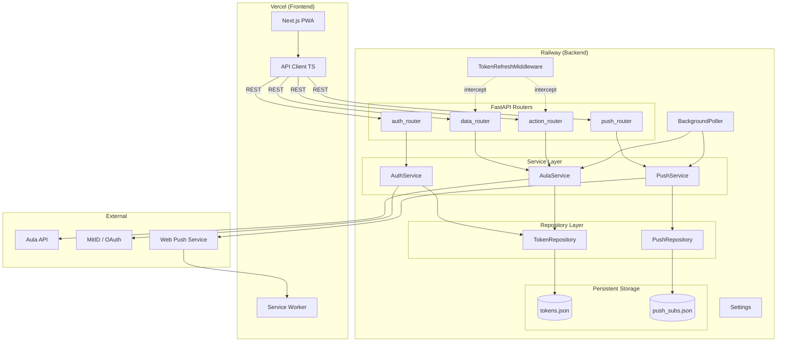

# Aula PWA — Implementation Plan

> Converted from Home Assistant custom integration to standalone PWA with FastAPI backend.

## Business Rules Analysis

| Rule # | Business Rule | Source | Hook Point? | Existing Pattern? |
|--------|---------------|--------|-------------|-------------------|
| 1 | Users authenticate via MitID (app or token device) through the existing OAuth/SAML chain | Requirements + Code | Auth endpoint | Yes — `aula_login_client` |
| 2 | QR code is displayed to user during MitID app auth; frontend polls for completion | Code | Auth status endpoint | Yes — `views.py` JS polling |
| 3 | If multiple identities exist, user must select one before proceeding | Code | Identity selection endpoint | Yes — `config_flow.py` |
| 4 | Access tokens are refreshed automatically before expiry; refresh tokens may rotate | Code | Middleware | Yes — `client.py` |
| 5 | Backend persists auth tokens in a local store (single-user, no multi-tenant DB needed) | Requirements + Clarification | Token store | No — new (file-based repository) |
| 6 | Backend exposes child profiles, presence, messages, calendar, weekly plans via REST API | Requirements | API routes | No — new endpoints |
| 7 | Backend supports write operations: sending messages and updating child presence | Clarification | API routes | Partial — `custom_api_call` exists |
| 8 | Frontend is a Next.js PWA served from Vercel; communicates with backend API on Railway | Requirements + Clarification | Infrastructure | No — new |
| 9 | Aula API version is auto-detected (tries v22, increments on HTTP 410) | Code | Client init | Yes — `_verify_api_access()` |
| 10 | Calendar data is parsed from lesson JSON (supports substitute teachers, locations) | Code | Calendar endpoint | Yes — `parseCalendarLesson()` |
| 11 | Backend polls Aula periodically (~5 min) to detect new messages | Clarification | Background task | No — new scheduler |
| 12 | PWA supports push notifications for new unread messages | Clarification | Web Push API | No — new |
| 13 | Single-user system — no user registration, multi-tenant DB, or account management needed | Clarification | Architecture | N/A |

**Technical Domains:** Auth/OAuth, REST API, Token persistence, PWA/Next.js, Web Push, Background jobs, Cloud deployment (Railway + Vercel)
**Reference Guidance:** Existing `aula_login_client` is the authoritative MitID integration (standalone Python, zero HA deps). `client.py` is ~90% reusable after removing 2 HA imports and `hass`/`config_entry` references.

---

## Architecture

### Pattern Applied

| Pattern | Where | Purpose |
|---------|-------|---------|
| Repository | Token + Push storage | Abstracts persistence, swappable backends (file → SQLite → Redis) |
| Service Layer | AuthService, AulaService, PushService | Business logic isolated from HTTP layer |
| Middleware | TokenRefreshMiddleware | Centralized token refresh before protected requests |
| Facade | AulaService | Single entry point to underlying `aula_client` |

### Component Overview

| Type | Name | Responsibility | Key Interactions |
|------|------|----------------|------------------|
| Module | `aula_login_client/` | MitID OAuth/SAML auth (reused as-is) | Used by `AuthService` |
| Module | `aula_client.py` | Forked `client.py`, HA refs removed | Used by `AulaService` |
| Model | `schemas.py` | Pydantic models: `Child`, `Presence`, `Message`, `CalendarEvent`, `WeeklyPlan`, `AuthStatus`, `PushSubscription` | Used everywhere |
| Repository | `TokenRepository` | Abstract token CRUD; `FileTokenRepository` impl | Used by `AuthService`, `AulaService` |
| Repository | `PushRepository` | Abstract push subscription CRUD; `FilePushRepository` impl | Used by `PushService` |
| Service | `AuthService` | Manages auth flow lifecycle: start → poll → identity select → complete | Uses `aula_login_client`, `TokenRepository` |
| Service | `AulaService` | Wraps `aula_client`, auto-refreshes tokens, normalizes data into Pydantic models | Uses `aula_client`, `TokenRepository` |
| Service | `PushService` | Manages push subscriptions, sends notifications | Uses `PushRepository`, `pywebpush` |
| Router | `auth_router.py` | Auth endpoints (`/auth/start`, `/auth/status`, `/auth/select-identity`) | Calls `AuthService` |
| Router | `data_router.py` | Read endpoints: `/children`, `/presence/{id}`, `/messages`, `/calendar/{id}`, `/ugeplan/{id}` | Calls `AulaService` |
| Router | `action_router.py` | Write endpoints: `/messages/send`, `/presence/update` | Calls `AulaService` |
| Router | `push_router.py` | `/push/subscribe`, `/push/unsubscribe` | Calls `PushService` |
| Middleware | `TokenRefreshMiddleware` | Checks/refreshes Aula tokens before protected requests | Calls `AulaService` |
| Scheduler | `BackgroundPoller` | Periodic data refresh + push notification trigger | Uses `AulaService`, `PushService` |
| Config | `settings.py` | Pydantic `BaseSettings` — env vars for VAPID keys, poll interval, etc. | Used everywhere |
| Frontend | Next.js PWA | Pages: Login, Dashboard, Messages, Calendar | Calls backend API |
| Frontend | `api-client.ts` | Typed API client generated from OpenAPI spec | Used by all pages |
| Frontend | `service-worker.ts` | PWA service worker: caching, push notification handler | Registered at install |

### Architecture Diagram

### Design Decisions

| Decision | Choice | Rationale |
|----------|--------|-----------|
| Token persistence | Repository pattern with file backend | Swappable to SQLite/Redis later without touching services |
| API models | Pydantic schemas | Typed responses, auto OpenAPI spec, frontend codegen |
| Frontend API client | Generated from OpenAPI | Type-safe, stays in sync with backend |
| Routers | Split by concern (auth/data/action/push) | Clear separation, easier testing |
| Middleware | Token refresh middleware | Centralized, no manual refresh calls in each endpoint |
| Config | Pydantic `BaseSettings` | Type-safe env vars, Railway-friendly |
| Push notifications | `pywebpush` + VAPID | Standard Web Push, no third-party push service needed |
| Background polling | APScheduler in-process | Simple, configurable interval via settings |
| Client reuse | Fork `client.py`, remove HA imports/refs | Minimal changes, preserves all Aula API logic |

---

## Test Plan

### Scope

- **Feature**: Aula PWA — Backend API + Frontend
- **Environment**: Dev (local) + CI
- **Type**: Automated (pytest backend, Jest/Vitest frontend)

### Checklist

- [ ] MitID auth flow starts, polls, and completes correctly
- [ ] Identity selection works when multiple identities exist
- [ ] Token persistence and refresh works across restarts
- [ ] All read endpoints return correct Pydantic-typed data
- [ ] Write operations call correct Aula API methods
- [ ] Background poller runs on schedule and triggers push notifications
- [ ] Push subscription management works
- [ ] Calendar lesson parsing handles edge cases
- [ ] API returns proper errors for expired/missing tokens

### Scenario Inventory

| # | Scenario | Type | Risk | Preconditions | Evidence |
|---|----------|------|------|---------------|----------|
| 1 | Auth flow: start → poll → complete | Auto | High | Mock `aula_login_client` | Tokens returned + persisted |
| 2 | Auth flow: identity selection required | Auto | High | Mock returns multiple identities | Flow resolves after selection |
| 3 | Auth flow: MitID timeout | Auto | Med | Mock raises timeout | 408 response |
| 4 | Auth flow: invalid credentials | Auto | Med | Mock raises `AulaAuthenticationError` | 401 response |
| 5 | Token auto-refresh before expiry | Auto | High | Near-expired token in repo | Middleware refreshes, request succeeds |
| 6 | Refresh token also expired | Auto | High | Both tokens expired | 401, re-auth required |
| 7 | Token persistence across restart | Auto | High | Tokens saved to file | New service loads tokens |
| 8 | GET /children | Auto | Low | Mock AulaService | JSON matches `Child` schema |
| 9 | GET /presence/{child_id} | Auto | Low | Mock AulaService | JSON matches `Presence` schema |
| 10 | GET /messages | Auto | Low | Mock AulaService | JSON matches `Message` schema |
| 11 | GET /calendar/{child_id} | Auto | Low | Mock AulaService | JSON matches `CalendarEvent` schema |
| 12 | GET /ugeplan/{child_id} | Auto | Low | Mock AulaService | JSON matches `WeeklyPlan` schema |
| 13 | POST /messages/send | Auto | Med | Mock AulaService | Service method called correctly |
| 14 | POST /presence/update | Auto | Med | Mock AulaService | Service method called correctly |
| 15 | Poller detects new message → sends push | Auto | High | New unread + push sub exists | `webpush()` called |
| 16 | Poller: no new messages → no push | Auto | Low | Same data as before | `send_notification()` not called |
| 17 | Push subscribe/unsubscribe | Auto | Med | Valid VAPID config | Subscription stored/removed |
| 18 | Calendar: substitute with location | Auto | Low | Fixture JSON | Summary + location correct |
| 19 | Calendar: substitute without location | Auto | Low | Fixture JSON | Summary correct, location None |
| 20 | API version fallback on 410 | Auto | Med | Mock 410 on v22 | Client uses v23 |
| 21 | Unauthenticated request | Auto | Med | No token | 401 response |
| 22 | Frontend: dashboard renders children | Auto (Jest) | Low | Mocked API | Child cards visible |
| 23 | Frontend: login page shows QR | Auto (Jest) | Med | Mocked auth status | QR element rendered |

### Scenarios

#### Scenario 1: Auth flow happy path
- **Rule(s):** R1, R2, R5
- **Preconditions:** Mock `aula_login_client.authenticate()` returns success with tokens
- **Steps:** POST `/auth/start` → poll `/auth/status/{flow_id}` → status becomes "complete"
- **Expected Results:** 200 with tokens; `TokenRepository.save()` called
- **Evidence:** Response validates against `AuthStatus` schema; token file written

#### Scenario 2: Identity selection
- **Rule(s):** R3
- **Preconditions:** Mock client returns 2 identities
- **Steps:** Start auth → poll gets `identity_selection` → POST `/auth/select-identity` → poll gets `complete`
- **Expected Results:** Flow completes with selected identity; tokens persisted
- **Evidence:** `aula_client` initialized with correct identity index

#### Scenario 3: MitID timeout
- **Rule(s):** R1
- **Preconditions:** Mock raises timeout
- **Steps:** Start auth → poll until timeout
- **Expected Results:** Status returns `error` with timeout message
- **Evidence:** 408 response; no tokens persisted

#### Scenario 4: Invalid credentials
- **Rule(s):** R1
- **Preconditions:** Mock raises `AulaAuthenticationError`
- **Steps:** POST `/auth/start` → poll status
- **Expected Results:** `status: "error"` with auth failure
- **Evidence:** 401 response; no tokens persisted

#### Scenario 5: Token auto-refresh
- **Rule(s):** R4
- **Preconditions:** Token in repo with `expires_at` = 2 min from now
- **Steps:** GET `/children` triggers middleware → middleware refreshes token
- **Expected Results:** Request succeeds with 200; new token persisted
- **Evidence:** `TokenRepository.save()` called with updated expiry

#### Scenario 6: Refresh token expired
- **Rule(s):** R4
- **Preconditions:** Both tokens expired
- **Steps:** GET `/children` → middleware refresh fails
- **Expected Results:** 401 with `re_auth_required: true`
- **Evidence:** Response status 401

#### Scenario 7: Token persistence across restart
- **Rule(s):** R5
- **Preconditions:** Tokens saved via `FileTokenRepository`
- **Steps:** Save tokens → create new `AulaService` → service loads from repo
- **Expected Results:** Service initializes with valid tokens, no re-auth
- **Evidence:** Client has correct token values

#### Scenarios 8-12: Read endpoints (parameterized)
- **Rule(s):** R6
- **Preconditions:** `AulaService` mocked with fixture data
- **Steps:** GET endpoint → validate response schema
- **Expected Results:** 200 with correctly shaped JSON
- **Evidence:** Pydantic model validation passes

#### Scenarios 13-14: Write operations
- **Rule(s):** R7
- **Preconditions:** `AulaService` mocked
- **Steps:** POST with body → verify service method called
- **Expected Results:** 200/201
- **Evidence:** Mock assertion on call args

#### Scenario 15: Poller triggers push
- **Rule(s):** R11, R12
- **Preconditions:** New unread message detected; push subscription exists
- **Steps:** Poller tick → detects increase → calls `PushService`
- **Expected Results:** Push notification sent
- **Evidence:** `pywebpush.webpush()` called with correct payload

#### Scenarios 18-19: Calendar parsing
- **Rule(s):** R9
- **Preconditions:** JSON fixture files
- **Steps:** `parseCalendarLesson(fixture)` → assert fields
- **Expected Results:** Correct summary/location
- **Evidence:** Assertions pass (existing tests preserved)

#### Scenario 20: API version fallback
- **Rule(s):** R8
- **Preconditions:** Mock Aula returns 410 for v22
- **Steps:** `_verify_api_access()` → 410 → retry v23
- **Expected Results:** Client uses v23
- **Evidence:** `_api_version == 23`

#### Scenario 21: Unauthenticated request
- **Rule(s):** R4, R5
- **Preconditions:** No token
- **Steps:** GET `/children` without auth header
- **Expected Results:** 401 Unauthorized
- **Evidence:** Error response body
